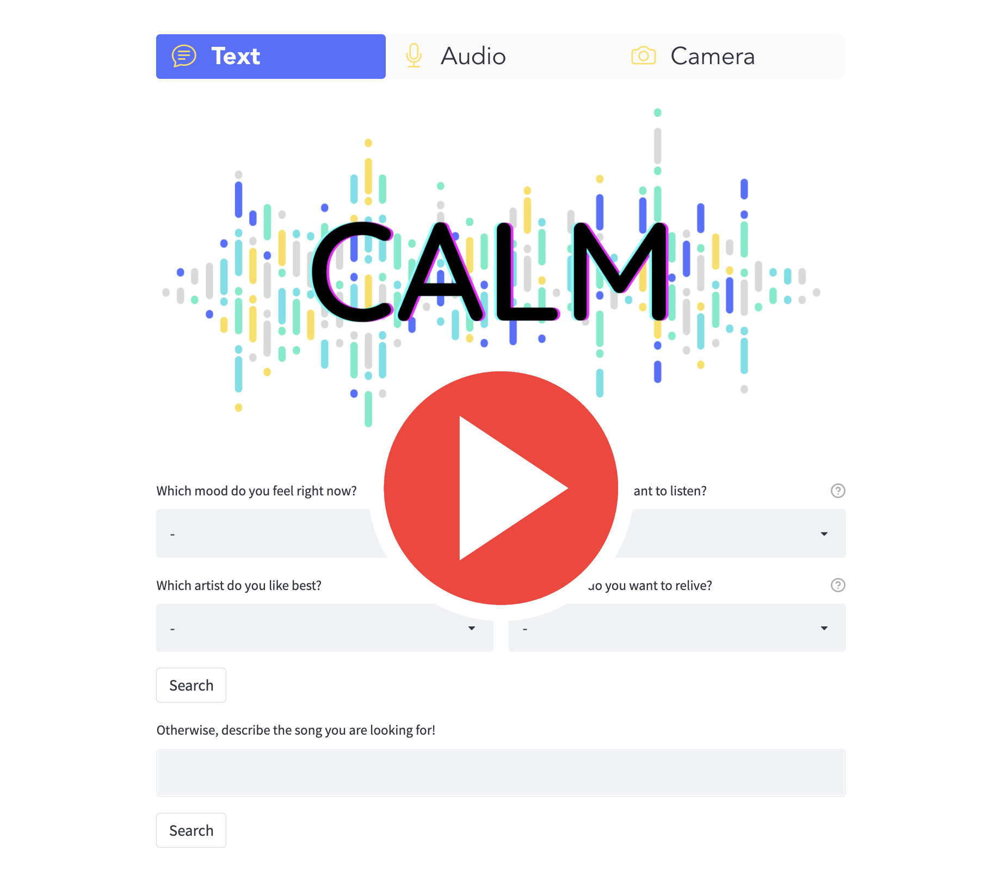
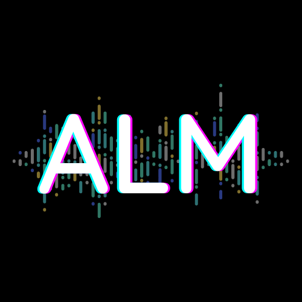

# CALM - Contrastive Alignment of Language and Music

Project for the ``1st Sound of AI Hackathon``

Group composed by *Alkis Koudounas*, *Lorenzo Vaiani*, *Moreno La Quatra*.

***

## What we propose
In a nutshell: our idea is to align songs with their natural language description such that we can use text, voice or facial expression to search music.

***

## Who is our target
People using music streaming services:
* Casual listeners 
* Explorers
* Public places

***

## What is our impact
``CALM`` will have a direct impact on:
* People using streaming service. Explore new music everyday.
* New releases that may be immediately included in search.
* People who can search using multiple modalities.

***

## A small DEMO
Here is a small overview of our web application.

For a complete demo, you can have a look here!

***

## 🤌🏻 About the project 
CALM is a project created by [Alkis Koudounas](https://koudounasalkis.github.io), [Lorenzo Vaiani](https://twitter.com/VaianiLorenzo), and [Moreno La Quatra](https://www.mlaquatra.me). It is part of the ***The 1st Sound of AI Hackathon***.

  

